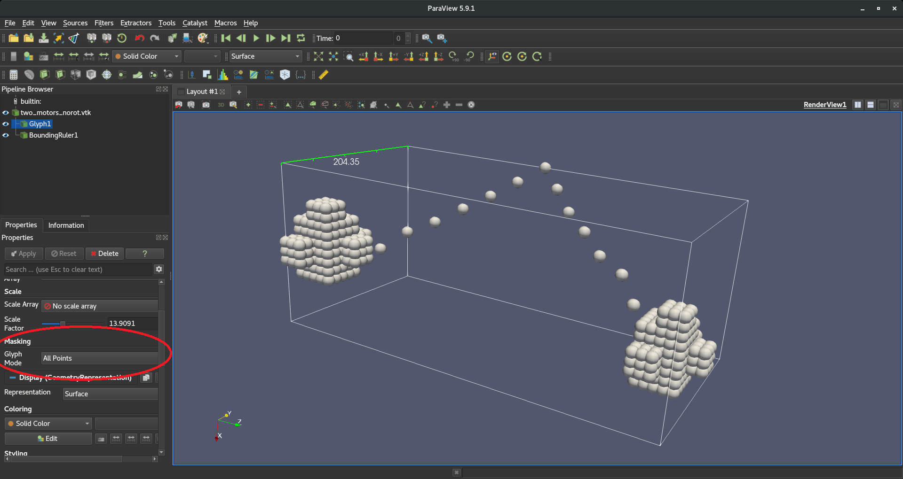

FFEA Meshing {#ffea_meshing}
============

ffea-meshing are a series of Python tools for [FFEA](https://bitbucket.org/FFEA/ffea/downloads/) tetrahrdral meshes.

The tools include:
    * a visualization tool that allows the user to interactively explore the tetrahedral mesh and select the worst and best elements using a number of recognised criteria.

    * rescale mrc files (used to collect cryo-em data)

    * convert mrc data into tetrahedral meshes using a 5 or 6 fold marching tetrahedron algorithm which results in a blocky surface

    * optimisation vis simulated annealing to smooth the surface.

This project was started in summer 2021.

Version
============
This is version 1.0

Copyright and License
============

The algorithm and software in this project were developed by the FFEA team at the University of Leeds. The main funding for this was Joanna Leng's Research Software Engineering Fellowship (EP/R025819/1).

Copyright 2020 FFEA team.

Licensed under GNU General Public License v3.0 as published by the Free Software Foundation, either version 3 of the License, or (at your option) any later version. You may not use this file except in compliance with the License. You may obtain a copy of the License at http://www.gnu.org/licenses/

Unless required by applicable law or agreed to in writing, software distributed under the License is distributed on an "AS IS" BASIS, WITHOUT WARRANTIES OR CONDITIONS OF ANY KIND, either express or implied. See the License for the specific language governing permissions and limitations under the License.

DEVELOPED WITH:
============

This was developed using Python 3.9 and Anaconda, Inc. on Windows 10 systems.

QUICK START:
============

Immediately below are a set of instructions that allow you to execute the cpt software quickly. There are no explanations of the steps here. Please look at the rest of the README file if you have any problems.

This software uses Anaconda with Python 3.9 so you will need to install and open an Anaconda shell. Once that is open, move to the top directory of ffea-meshing (the directory with the file README.md in it) and type the following the FIRST time you run the ffea-meshing software. Not all the instructions are required for later runs:

`conda env create -f environment_ffea-mesh.yml`

Next, activate the cpt Anaconda environment using the following command:

`conda activate ffea-mesh`

Now install the cpt tools into the cpt environment:

`pip install --editable . -v`

Execution of the visualizer:

`tgv.py`

Execution of a command line script is in this format when you download the mvc file called filename.

` mrc_header_info.py -i filename`

And to get help on how to use a script:

` mrc_header_info.py --help`

If you want to use them to write your own python scripts you can now import them into a script.

`import cpt`

MANAGING THE ffea_mesh ENVIRONMENT:
============

The Anaconda environment, with all the necessary modules, can be set up using the environment_ffea-mesh.yml file.

We advise you to get your conda installation up to date before you do this but this is not obligatory with the command:

`conda update --all`

To see what conda environments you have, run the command

`conda env list`

To create a new Anaconda environment for cpt, run the command

`conda env create -f environment_ffea-mesh.yml`

To start using the environment, run the command

`conda activate ffea-mesh.yml`

To stop using that enviroment:

`conda deactivate`

To remove the environment, if you no longer want to use ffea-mesh:

`conda env remove --name ffea-mesh`

Scripts {#scripts}
=============
   * **fft_smooth.py** - Smoooths density data in a mrc fileusing a fast fourier transform function.

   * **five_tets.py** - process MRC files and produces a regular tetrahedral volumetric
    mesh for FFEA using the "marching tet" algorithm. This is written out in the tetgen
    .ele, .face, and .node file format for later use in FFEA, and .vtk for mesh analysis.

   * **make_test_mrcfile.py** - makes simple mrc image file for use in testing

   * **make_tet_mesh_examples.py** - Make a pair of voxels decomposed into tetrahedra
    and output in VTK format. 5 and 6 tetrahedra decompositions are available.

   * **mrc_crop.py** - crops 3D mrc image file data

   * **mrc_density_section.py** - run a density scan across an mrc file
    on  x, y and z axis printing out locations and image densities

   * **mrc_header_info.py** - print the header from an MRC file

   * **mrc_image_stats.py** - reads a mrc file and prints out its image intensity stats

   * **mrc_threshold.py** - reads a mrc file and set all voxels less than than the
    thershold to zero, then outputs to a new file

   * **mrc_voxel_size.py** - print an MRC file's voxel size

   * **sim_anneal.py** - optimizes a tetrahedral mesh using simulated annealing

   * **six_tets.py** - process MRC files and produces a regular tetrahedral volumetric mesh for FFEA using the "marching tet" algorithm. This is written out in the tetgen .ele, .face, and .node file format for later use in FFEA, and .vtk for mesh analysis.

   * **zoom.py** - Coarsens MRC files to a user-defined resolution and
    outputs them as a new .mrc file. Can be called by tet_from_pix.

Prerequisites {#prerequisites}
=============

   * [Python (>= 3.8)](https://www.python.org/).
     Required for running the tool scripts.

   * [NumPy (<1.23.0)](https://numpy.org/).
     Required Python library.

   * [SciPy](https://scipy.org/).
     Required Python library.

   * [VTK for Python](https://pypi.org/project/vtk/).
     Required Python library.

   * [mrcfile for Python](https://pypi.org/project/mrcfile/).
     Required Python library.

   * [doxygen](https://pypi.org/project/doxypypy/)
     Required for building documentation

   * [pylint](https://pypi.org/project/pylint/)
     Required for development

Installation {#installation}
============
Get a copy of the latest version from bitbucket by running

`git clone https://bitbucket.org/FFEA/ffea-meshing.git/`

or, if you alreay have cloned

`git pull`

If you have an old conda environment remove it.

`conda env remove --name ffea-mesh`

Create a new environment

`conda env create -f .\environment_ffea-mesh.yml`

Activate the environment

`conda activate ffea-mesh`

Install the package to the environment using pip

`pip install --editable .`

Make the documentation run doxygen

`doxygen`

Available Programs {#programs}
=================

The programs are provided in the ffeamesh/scripts directory.  They are listed here grouped by function.

Meta Data {#programs-meta}
---------
- mrc_header_info.py: List all header information in MRC file.
- mrc_image_stats.py: Image intensity stats in ten bins.
- mrc_voxel_size.py: Report the voxel size for MRC file.

Filter {#programs-filter}
------
- mrc_crop.py: Cut a subset out of image and save in new file.
- mrc_threshold.py: Make new MRC image with all voxels below threshold set to zero.
- zoom.py: Reduce the number of voxels in MRC file.
- fft_smooth.py: Smooth data in MRC file using Fast Fourier Transform (FFT).

Meshing {#programs-meshing}
------
- five_tets.py: Threshold image and convert surviving voxels into five tetrahedrons.
- six_tets.py: Threshold image and convert surviving voxels into six tetrahedrons.

How to Use {#how}
=============

As these are simply scripts there is no installation required other than the
 [prerequisites](\ref prerequisites).

tet_from_pix {#tetfrompix}
-------------

tet_from_pix inputs MRC files and processes them to produce volumetric mesh
 files for use with FFEA. VTK files are also produced for mesh analysis.

To get started quickly, the usage message can be viewed with the following command:

      python tet_from_pix.py -h

In order to run tet_from_pix to produce volumetric mesh files, there are three
 required flags:

   * `-i` or `--input` - The filepath to the input MRC file to be processed.
   * `-o` or `--output` - The name to be given to the output files. A filepath
    can also be provided for this. Do not include a file extension suffix as
    there will be multiple different kinds.
   * `-t` or `--threshold` - <!-- Molly - can you explain this -->

Running the required flags on an MRC would look something like the example
 command:

      python tet_from_pix.py -i /path/to/input.mrc -o /path/to/output -t 0.12345

Optionally, an MRC file can first be coarsened to a user-specified resolution
 before producing mesh files using the flag `-r` or `--resolution`, followed by
 the resolution value. See [mrc_zoom](\ref mrczoom) for further explanation, as
 this flag passes the input MRC file to this script and returns the output.

In the output directory defined by `-o` or `--output`, the following files will
 be found after running tet_from_pix successfully, where [outputname] is the
 user-defined name of the output files:

   * [outputname].1.ele
   * [outputname].1.face
   * [outputname].1.node
   * [outputname].mrc (if the `-r` or `--resolution` flag was called)
   * [outputname].vtk

mrc_zoom {#mrczoom}
-------------

mrc_zoom inputs MRC files and allows a user to coarsen them to a defined
 resolution, and outputs them as a new MRC file. This is seperated from
 tet_from_pix as a standalone script for users that only wish to coarsen an
 MRC file, rather than go through the whole process of producing volumetric
 mesh files.

To get started quickly, the usage message can be viewed with the following command:

      python mrc_zoom.py -h

In order to run tet_from_pix to produce volumetric mesh files, there are three
required flags:

   * `-i` or `--input` - The filepath to the input MRC file to be coarsened.
   * `-o` or `--output` - The name to be given to the output file. A filepath
    can also be provided for this. A file extension suffix is not needed.
   * `-r` or `--resolution` - A number value of the resolution to coarsen the
    MRC file to. <!-- Molly - you might be able to give more detail here -->

Running the required flags on an MRC would look something like the example
 command:

      python mrc_zoom.py -i /path/to/input.mrc -o /path/to/output -r 10

In the output directory defined by `-o` or `--output`, a new .mrc file will be
 found after running mrc_zoom successfully of the coarsened MRC, named after the
 user-defined output name.

<!-- Note: This README style is inconsistent because of format changes made in the branch interpolation which will be merged at a later date. I had to compromise. -->
## ffea_convert_to_vtk {#ffea-vtk}

ffea_convert_to_vtk inputs FFEA scripts to find their input mesh(s), apply any
 transformations as dictated by the script, and then output them as points-only
 VTK files for mesh analysis.

**NOTE**: This tool is currently incomplete. This will not yet process transformations
 dictated by coupling in FFEA scripts. This feature is to be added at a later date.

In order to run ffea_convert_to_vtk there are two required flags:

   * `-i` or `--input` - The filepath to the input FFEA file to be converted.
   * `-o` or `--output` - The destination filepath of the output VTK file.

Running the conversion tool would look something like the example command:

     python fea_convert_to_vtk.py -i /path/to/input.ffea -o /path/to/output

In the output directory defined by `-o` or `--output`, the file [outputname].vtk
 will be found, where [outputname] is the name of the input FFEA script.

The output VTK file can be viewed in ParaView for analysis. When the VTK file is
 first loaded into ParaView, there will be nothing to see. A Glyphs filter needs
 to be applied to it first. This is done by selecting the VTK in the Pipeline
 Browser on the left, and then applying the Glyphs filter found in Filters >
 Alphabetical/Common. When adding these glyphs, ensure that in their properties
 that the Glyph Mode under Masking is set to All Points (see example in image
 below) or there will be vertices missing. The size and shape of the glyphs can
 also be adjusted in this properties panel.

Unit Tests {#unit}
=============

The directory `tests` contain unit tests for developers working on ffea-meshing.
 Inside is a script called `unit_tests.py` which executes the tests, and the
 required input and output files for these tests.

To get started quickly, the usage message can be viewed with the following command:

      python unit_tests.py -h

There are three unit tests, which are as follows:

   1. Tests running tet_from_pix without coarsening the input MRC file.
   2. Tests running mrc_zoom.
   3. Tests running tet_from_pix with coarsening of the input MRC file.

If unit_tests is called with no flags, all three tests will run. To run specific
 tests, use the `t` or `--test` flag with the number(s) of test(s). For example,
 to run tests 1 and 3, run the following command:

      python unit_tests.py -t 1,3

The command line will print out each test ran and state if they passed or failed.
